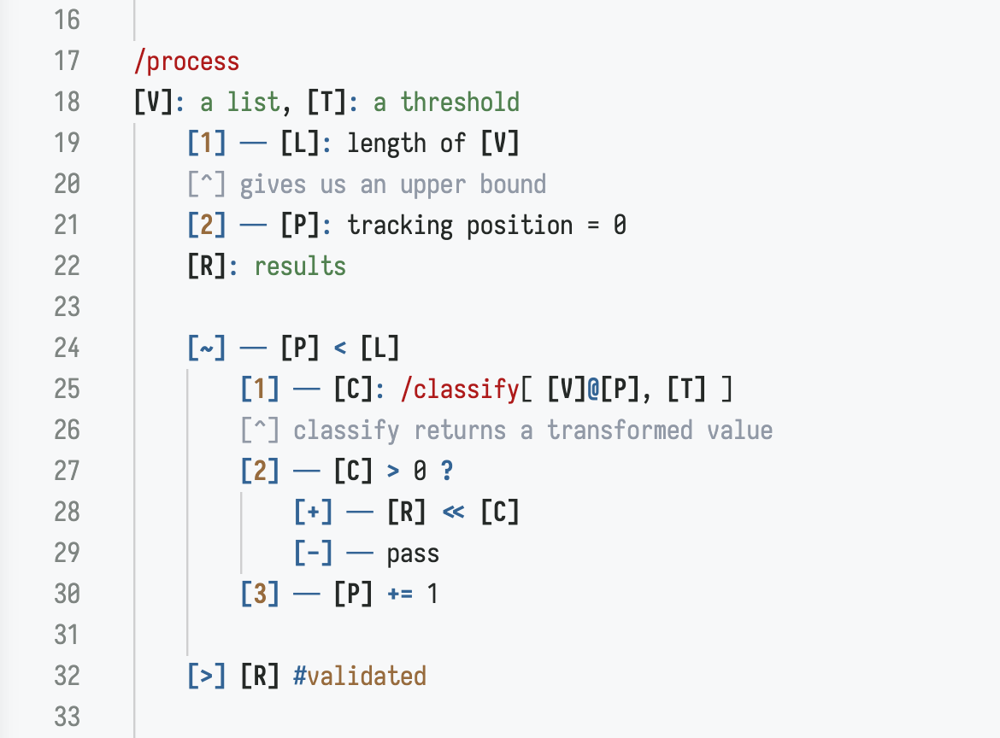

# JAW

**JAW** (_just a word_) is a pseudocode and commenting language.

*Spec first — Implement later*



## Syntax

### Variables

Global variables: `[<identifier>] — description`

Inline assignment: `[<identifier>]: description` or `[<identifier>]: description = value`

```
[V] — a 1D vector
[L]: length of [V]
[L]: length of [V] = 0
```

### Functions

One-line: `/<name> [<arg>]: <description>, ...`

Two-line: `/<name>` on one line, arguments on the next.

```
/Add [A]: an integer, [B]: an integer

/Subtract
[A]: an integer, [B]: an integer
```

### Steps

Syntax: `[<number>] — <action>`

```
[1] — [V]: array = [82,3,47,15,61]
[2] — Sort [V]
[3] — Filter [V]
[>] [V]
```

### Comments

`[^]` code comment (under a step), `[*]` general comment. Both support multi-line continuation until the next JAW construct.

```
[1] — sort [V]
[^] this sorts the vector
using a quicksort variant

[*] a general note
that spans multiple lines
```

### Logging

Syntax: `[!] — <log-statement>`

Supports variable refs inline, log-level decorators (`#error`, `#warn`), and multi-line with indentation. An optional title ending in `:` on the first line is italicized.

```
[!] — simple log
[!] — #error something went wrong with [V]
[!] — Title:
	multi-line log content
	[V]@[P] added to [R]
```

### Returns

Syntax: `[>] <return-value>`

```
[>] [A] + [B]
[>] /LastAdd[ [X] ]
```

### Conditionals

Simple: `[<step>] — <condition> ? /True[ args ] | /False[ args ]`

Chained: `[<step>] — <cond> ? /A[ args ] | <cond> ? /B[ args ] | /C[ args ]`

Complex (multi-step branches) using `[+]` and `[-]` blocks:

```
[1] — [R] == Admin ? /Grant[ [R] ] | /Deny[ [R] ]
[1] — [R] == Admin ? /Grant[ [R] ] | [R] == User ? /Limit[ [R] ] | /Deny[ [R] ]
[1] — [R] == Admin ?
	[+] — /Grant[ [R] ]
	[-] — /Deny[ [R] ]
```

### Loops

`[~]` is the loop marker — a condition (while) or iteration expression (for-each) governs repetition.

```
[~] — [P] < [L]
	[1] — [P] += 1

[~] — [X] in [V]
	[1] — do something with [X]

[~] — ([A], [B]) in [1]
	[1] — [A] * 0.5
	[2] — ([B] * 3) + 1
	[>] — [1] ** [2]
```

### Parallel Operations

`[&]` marks steps that execute concurrently. The algorithm continues after all complete.

```
[&]
	[1] — Fetch data from API
	[2] — Load cache from disk
[2] — Process results
```

### Decorators

`#name` or `#name:value` attach metadata to variables, steps, or functions.

```
[V] — a vector #mutable #type:list
[1] — sort [V] #complexity:O(nlogn)
/add #pure [A]: an integer, [B]: an integer
```

### Array Access

`@` accesses elements by index:
```
[1] — [V]@[P]
[^] vector [V] at position [P]

[1] — [D]@[K]
[^] Dictionary [D] at key [K]
```

### Operators

Standard notation: `+`, `-`, `*`, `/`, `==`, `>`, `<`, `>=`, `<=`, `!=`, `<<` (append), etc.

See the [Glossary](docs/glossary.md) for a complete reference of all markers and terms.

## Issues

One of the pain points in developing an explicit pseudocode language is determining how much of the syntax should be defined up front, and how much is at the user's discretion. JAW is flexible enough that plain text can be used in place of exact syntax. Meaning, one could write in natural language what a certain step should perform, or which function should be called with what arguments.
